# Executive Summary

### GitHub Repository URL: https://github.com/EthanWeissel/Milestone1_Group85.git

---

## 1. Food Search
### Description  
Enable users to search for foods by name and display all the nutritional information.

### Steps
1. Make sure you're on the Search Result page, if not, select the Search Result button
2. select the search bar under the text 'Food Search'
3. Type in a food item name
4. Press the Search Button
5. The results will now be shown on the screen. If the results contain too many results, be sure to refer to the page count and current page number on the bottom left, and navigate the pages using either button.

### Screenshots
Include screenshots for each step demonstrating the use of this feature.  
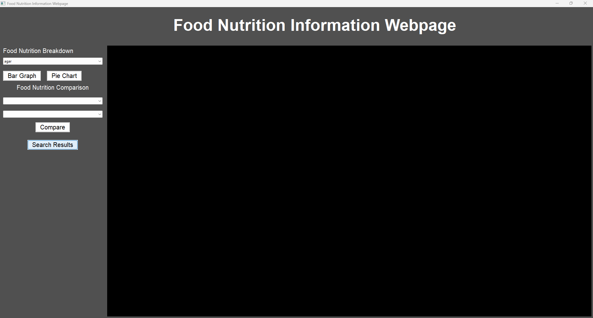

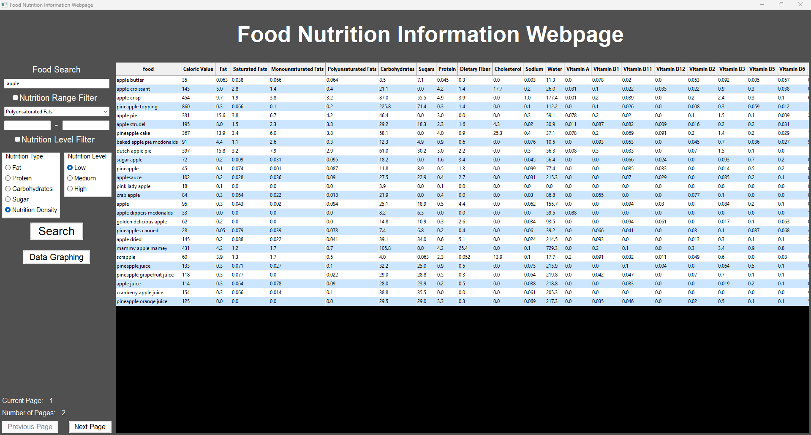

---

## 2.1. Nutrition Breakdown - Bar Graph
### Description  
This feature generates a bar chart showing the nutritional breakdown of a specified food item. It retrieves nutritional data like caloric value, protein, fat, and carbohydrates, and displays them in a visual bar chart.

### Steps
1. Make sure you're on the Data Graphing page, if not, select the Data Graphing Button
1. Select a food item from the drop-down list under the Food Nutrition Breakdown title.
3. Press the Bar Graph Button
4. Wait for the graph to refresh and use the visuals and data points to see nutrition data for both macro and micro, separated for your convenience.
### Screenshots
 
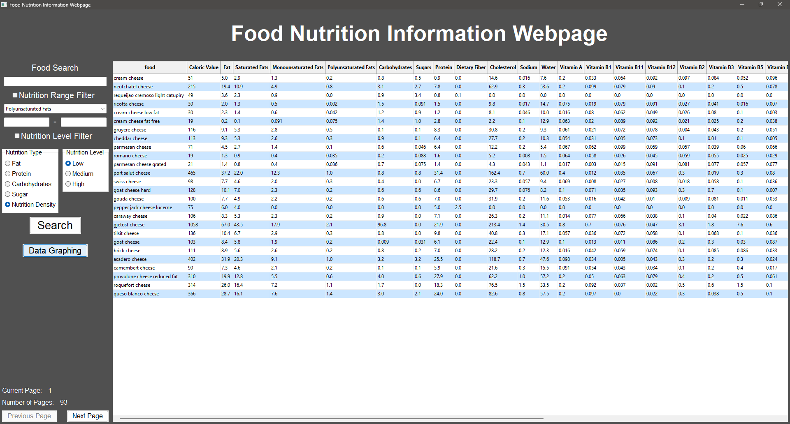
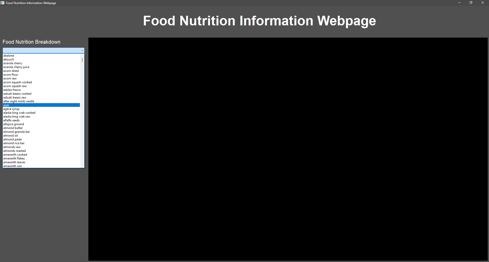
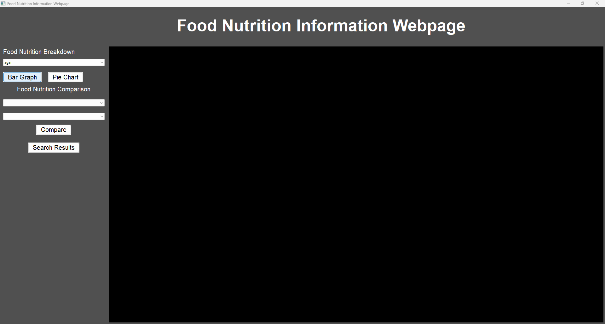
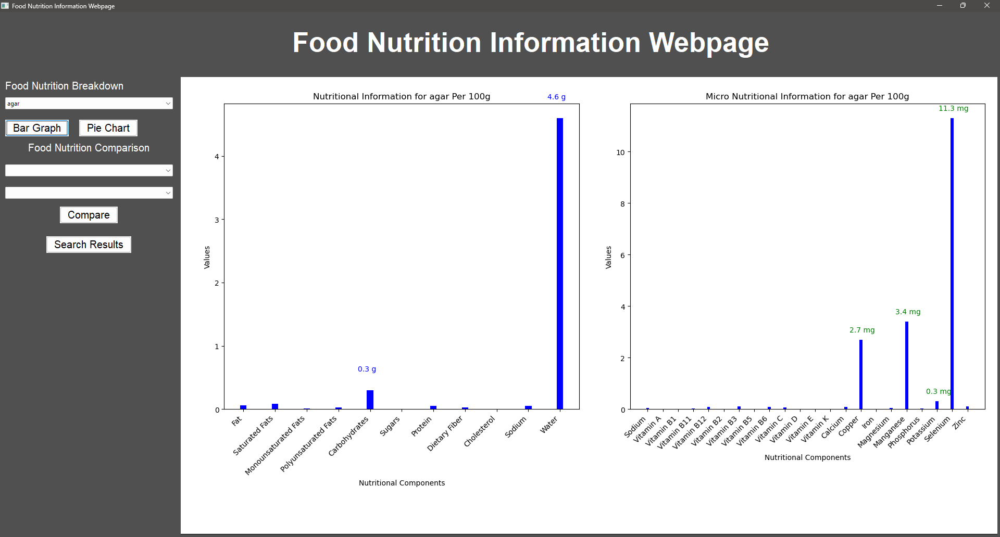

---

## 2.2. Nutrition Breakdown - Pie Chart
### Description  
This feature generates a pie chart showing the nutritional breakdown of a specified food item. It retrieves the mean values for nutrients like caloric value, protein, fat, and carbohydrates and displays them as a pie chart.

### Steps
1. Make sure you're on the Data Graphing page, if not, select the Data Graphing Button
1. Select a food item from the drop-down list under the Food Nutrition Breakdown title.
3. Press the Pie Chart Button
4. Wait for the graph to refresh and use the visuals and data points to see nutrition data for both macro and micro, separated for your convenience.
### Screenshots
 

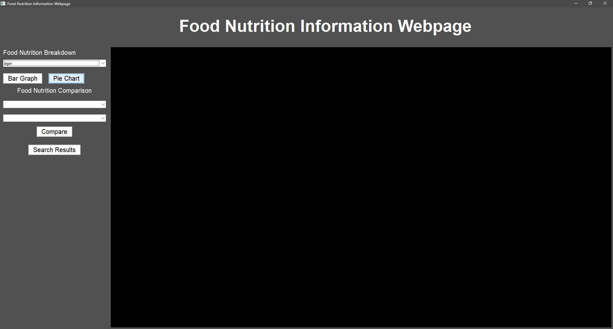

---

## 3.Nutrition Range Filter
### Description  
Enable users to select one of nutrition and input minimum & maximum values, and the tool will display a list of foods that fall within those ranges.

### Steps
1. Make sure you're on the Search Result page, if not, select the Search Result button
2. If you'd like to search a specific food item, refer to Function 1 on how to enter food name, then return here
3. Select the tick box next to Nutriton Range Filter text and make sure it is ticked
4. select a nutrition type from the dropdown list
5. if you want to set a minimum nutritional value, enter a number to serve as a minimum value in the left text box
6. if you want to set a maximum nutritional value, enter a number to serve as a maximum value in the right text box
7. press Search button
5. The results will now be shown on the screen. If the results contain too many results, be sure to refer to the page count and current page number on the bottom left, and navigate the pages using either button.

### Screenshots
 

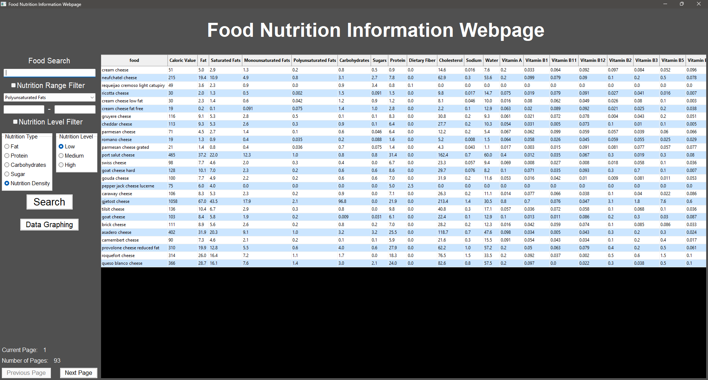

---

## 4.Nutrition Level Filter
### Description  
This feature allows the user to filter foods by their nutrition level. They can be filtered to show Less than 33% of the highest value, Between 33% and 66% of the highest value or Greater than 66% of the highest value for each of the nutrients. These nutrients include fat, protein, carbohydrates, sugar, and nutritional density.

### Steps
1. Ensure that you are on the Search Result page, if not select the search result button to swap.
2. Ensure that the nutrition Level Filter check box has been clicked and shows a blue tick
3. Select the nutrition type that you wish to filter the food items by
4. Select the nutrition level filter that you wish to apply.
5. Press search and then view your results on the right hand side of the screen. Keep in mind that some results may show a very low number of results as there may only be a small selection of foods that fall 66% higher than the highest result.

### Screenshots

---

## 5. Nutrition Comparison
### Description  
This feature compares the nutritional values of two different food items. It generates a bar chart comparing values like caloric value, protein, fat, and carbohydrates for both foods.

### Steps
1. Make sure you're on the Data Graphing page, if not, select the Data Graphing Button
1. Select a food item from the first drop-down list
2. Select a second food item from the second drop-down list, make sure to select a different one!
3. Press the Compare button
4. Wait for the graph to refresh and use the visuals and data points to compare the different nutritional values.

### Screenshots
Include screenshots for each step demonstrating the use of this feature.    

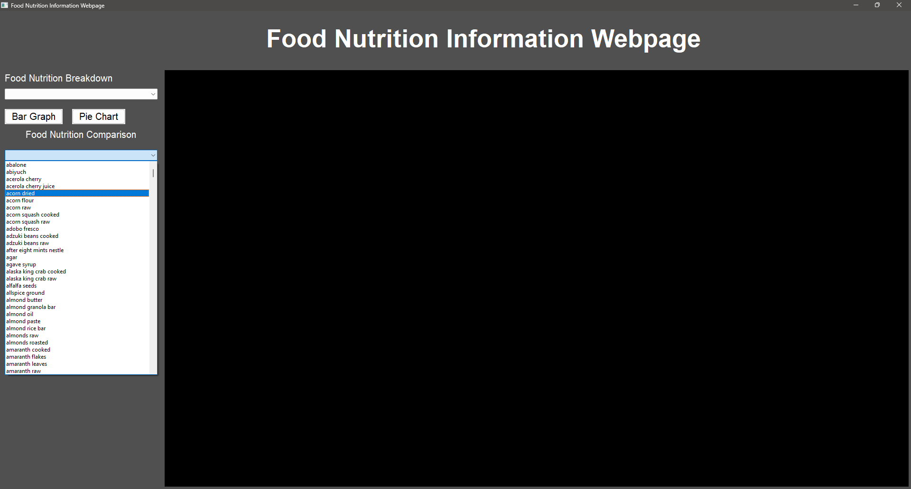
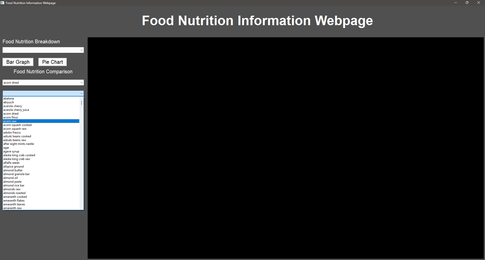
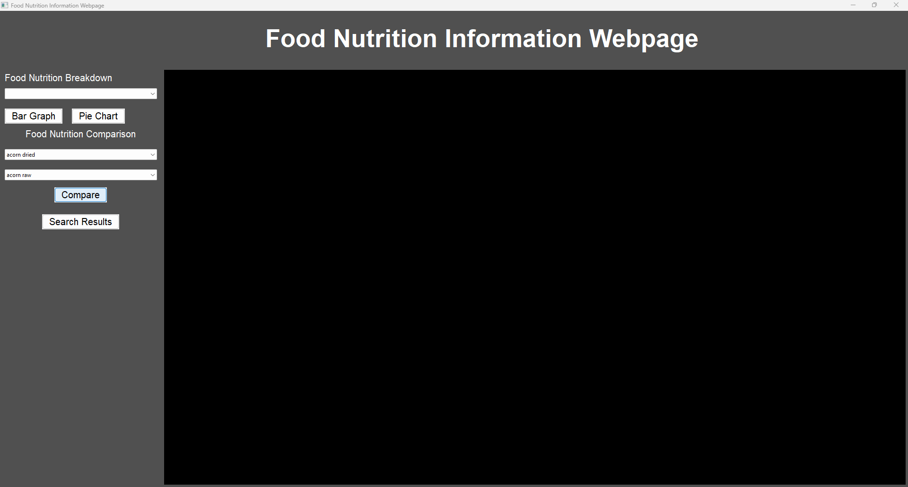
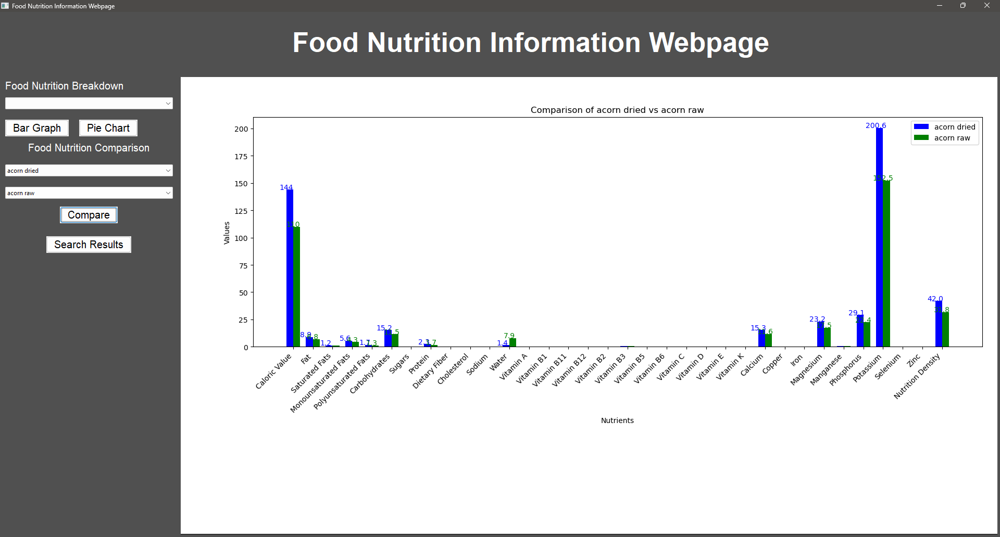

---
