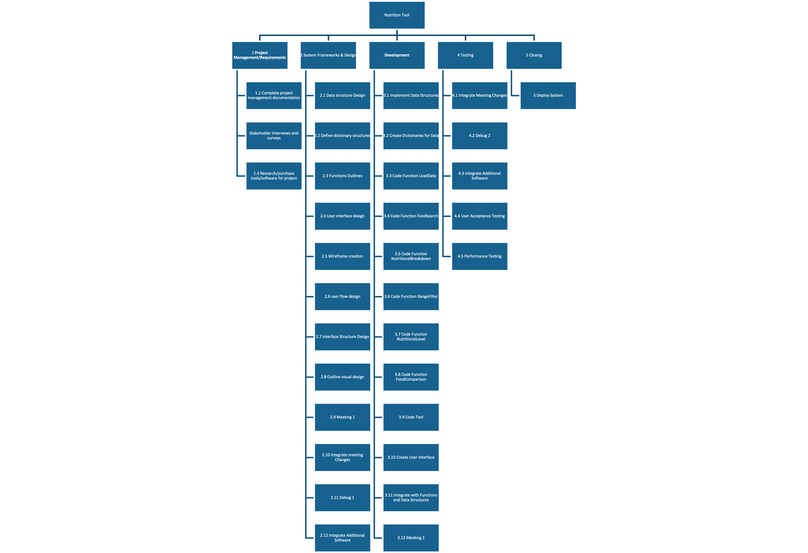
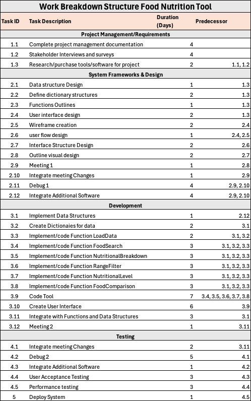
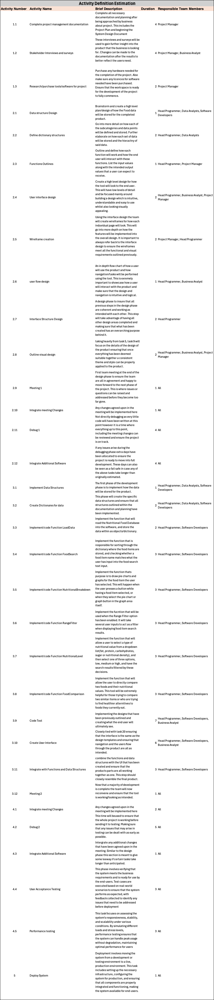
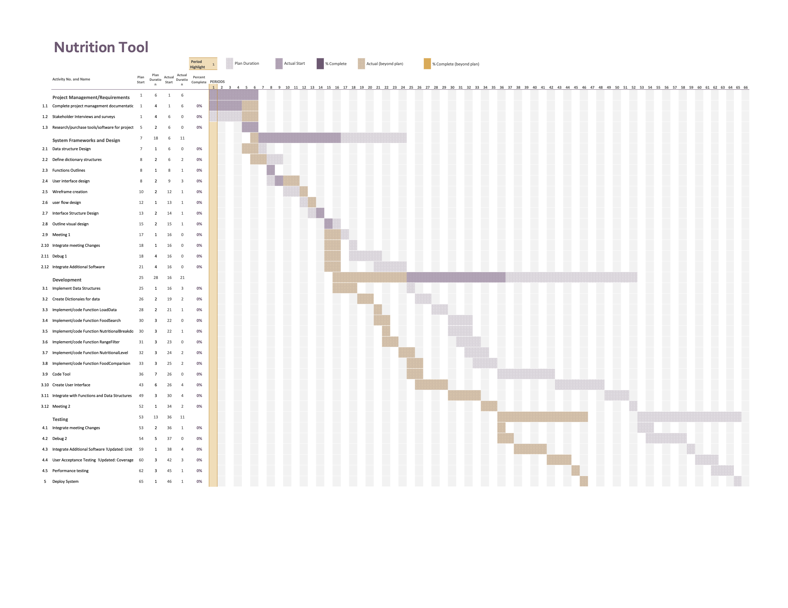

# Project Plan

## Project Name: Food Nutrition Information Webpage
## Group Number: 85

### Team members

| Student No. | Full Name                | GitHub Username                  | Contribution (sum to 100%) | 
|-------------|--------------------------|----------------------------------|----------------------------|
| s5290101    | Ethan Weissel            | ethan.weissel@griffithuni.edu.au | 33.3% or Equal             |
| s5379918    | Atharav Verma            | atharav.verma@griffithuni.edu.au                              | 33.3% or Equal             | 
| s2967734    | Jayden Alexander-Morpeth | jayden.alexander-morpeth@griffithuni.edu.au                              | 33.3% or Equal             | 

### Brief Description of Contribution

Please Describe what you have accomplished in this group project.
- s5290101, Ethan Weissel
  - Accomplishments: For this assignment I completed part of the Executive Summary and Unit testing. <mark style="background-color: #ff0000" >I was also responsible for the updating of the Software Design Doc, Project plan and Gantt Chart. I also played a very minimal role in the writing of the system code.
- s5379918, Atharav Verma
  - Accomplishments: Problem background, system capabilities/overview, potential benefits, user requirements, software requirements, use case diagrams and use cases.<mark style="background-color: #ff0000" > I contributed to coding the pie chart. I also wrote the testing, executive summary and documentation for the nutrition breakdown and nutrition comparison feature. I also reviewed and improved existing test cases of other team members.
- s2967734, Jayden Alexander-Morpeth
  - Accomplishments: For this project, I have designed the software design flowchart, written up the functions, designed the detailed design flowchart, designed the structural design flowchart, justified its design, designed the visual design mockups and justified their designs. <mark style="background-color: #ff0000" >I wrote most of the system code, developed the GUI, and did the testing for the search function and nutrition range filter.

# Table of Contents

* [Project Plan](#project-plan)
  * [1. Project Overview](#1-project-overview)
    * [1.1 Project Objectives](#11-project-objectives)
    * [1.2 Project Stakeholders](#12-project-stakeholders)
    * [1.3 Project Scope](#13-project-scope)
  * [2. Work Breakdown Structure](#2-work-breakdown-structure)
  * [3. Activity Definition Estimation](#3-activity-definition-estimation)
  * [4. Gantt Chart](#4-gantt-chart)

## 1. Project Overview

### 1.1 Project Objectives

The Food Nutritional Tool has two primary objectives:
firstly, to enable users to understand the nutritional values of different foods, and secondly, to facilitate comparisons
between these foods. This tool aims to help users assess the healthiness of various foods, find options that meet specific
nutritional criteria, and provide a platform for individuals with particular dietary requirements to identify suitable foods.

Comparing foods is also a key feature, allowing users to make more informed choices, find healthier substitutes for the foods
they currently consume, and discover similar foods to those they already enjoy.

### 1.2 Project Stakeholders

Many stakeholders will have a vested interest in the project both internally and externally. Internally the key stakeholders will be the project team developing the software and the company officials who will receive the finished software as a product. Externally the various end users are extremely important as they will be the ones using/purchasing the tool after the project is completed. Investors also have a keen interest in the quality and success of the project. Adhering to regulatory authorities is extremely important when concerning food along with keeping good relations with the suppliers of the food statistics if the tool is to be kept up to date.
### Internal
Project Team

    • Project Manager
    • Programmers/software developers
    • Data analysts
    • Cyber Security Analyst
    • Business Analyst

Marketing Team

Customer Support Team

Board of Directors
### External
Customers

	• Health Conscious individuals
	• Athletes & Coaches
	• People with dietary restrictions
	• Researchers/Universities
Investors

Regulatory Agencies

Suppliers and Collaborators 

### 1.3 Project Scope

### Inside the Project Scope – 
These features will be offered by the system and will offer the user a thorough analysis of each of the foods nutritional data
  
  • Allow users to search foods by name and see key nutritional statistics

  • Allow these stats to be broken down and displayed as bar and pie charts for further analysis of the data.
 
  • Enable users to select a nutritional element, input a maximum and minimum value and display all foods which fall within this range.

  • Enable users to filter foods by nutritional content levels, falling within a range of high medium or low.

  • Enable users to compare two foods side by side using both the key nutritional statistics and the bar and pie chart page to do so.
    !Update: Comparison of foods is only available as a Bar chart as it shows a far better comparison of the two foods. The comparison with the pir chart was considered to be inferior and unnecessary.!

  • Enable users to sort foods from highest to lowest and any nutritional statistic.<mark style="background-color: #ff0000" >
    !Update: Removed due to being outside the needed project scope. Was originally considered as the additional feature but was deemed not as beneficial.!

  • Have easily laid out code dictionaries in which foods can be added by collaborators in the future<mark style="background-color: #ff0000" >
    !Update: Considered Too Difficult to implement and outside project Scope.!

### Outside the Project Scope – 
These features will not offered within the project as they are either too complex or deemed not necessary to the projects success.

• Allow users to import or update food details/statistics
• Allow users access directly to the data used

• Allow users to compare more than 2 foods at one time

• Allow users to search for foods which meet more than one nutritional criteria

• Allow users have secondary filters when sorting from highest to lowest.

• Allow users to filter by ranges not specified above in the project scope

## 2. Work Breakdown Structure

Within the Work breakdown structure both a hierarchy and a table have been included to show further understanding of what tasks need to be completed in order to move forward in the project. Core themes of the project are broken down into deliverables, required to be completed before moving to the next theme. These themes are broken down into five sections; Project Managements/Requirements, System Framework and Design, Development, testing and closing.

Work_Breakdown_Structure.png

The table below further outlines the workbreakdown structure and what task can be completed in tandem and the dependencies for each one.

WBST.png

## 3. Activity Definition Estimation

Within the project different members of the team will be working on different parts at various times. All of the activities have been broken down and further explained within the description. A duration for each activity has also been defined to give the project an estimated overall completion time.

ADE.png

## 4. Gantt Chart

The Gantt chart for this project provides a visual timeline of key tasks, illustrating their start and end dates as well as their dependencies. It serves as a comprehensive schedule, allowing for clear tracking of project progress and ensuring that milestones are met on time. By outlining the duration and overlap of each activity, the chart aids in effective project management and resource allocation. 

!Update: The Gantt Chart over estimated the amount of time it would take us to complete many activities. In particular at the end of the design phase which was much smoother than anticipated. Some areas towards the end were update to better reflect the testing process.

Gantt_Chart_A1.png

