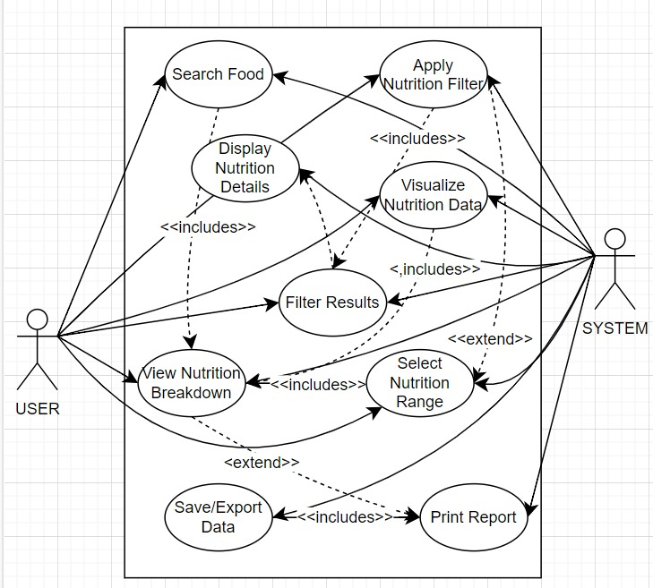
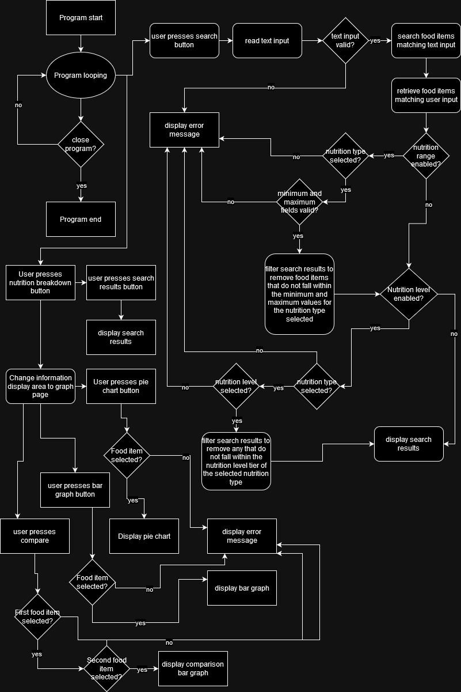
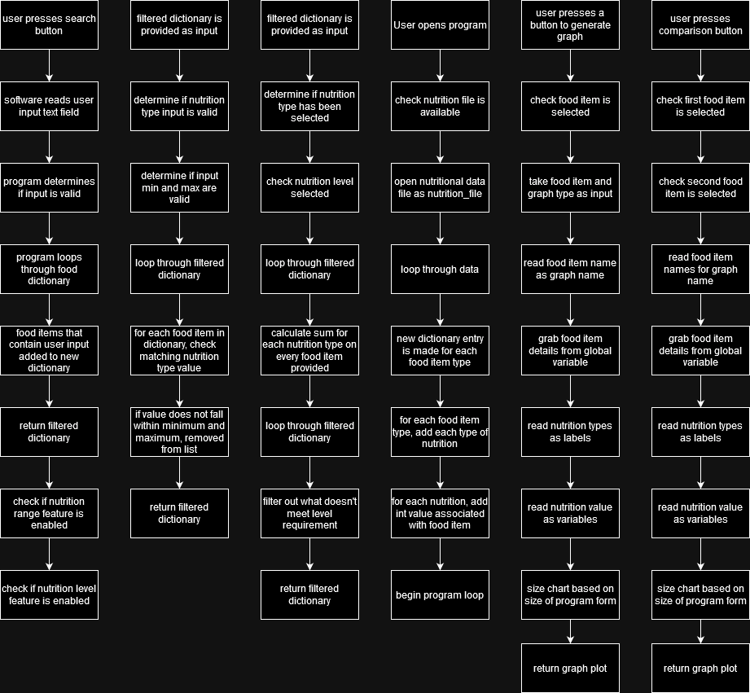
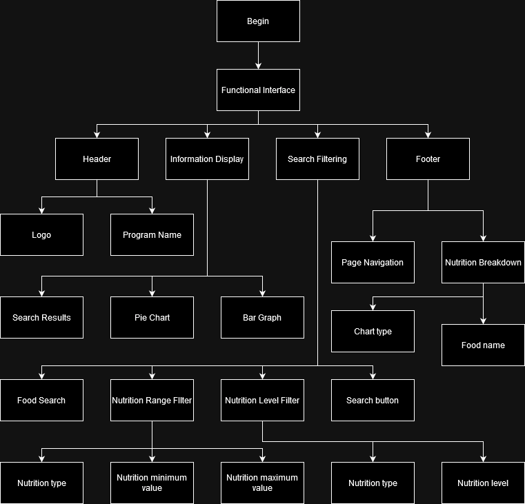
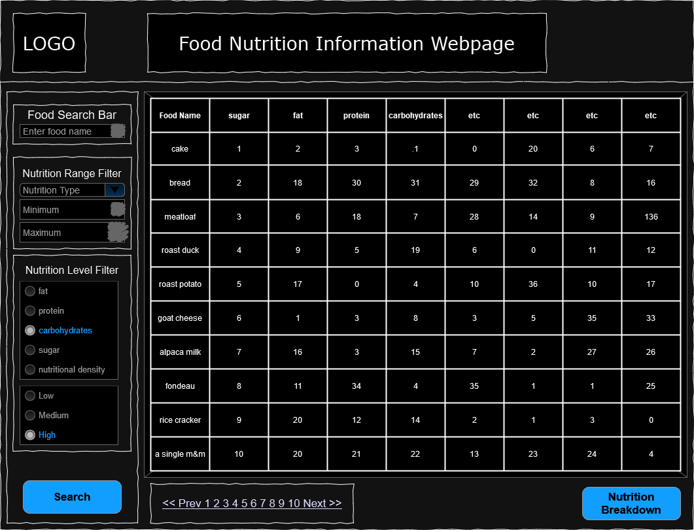
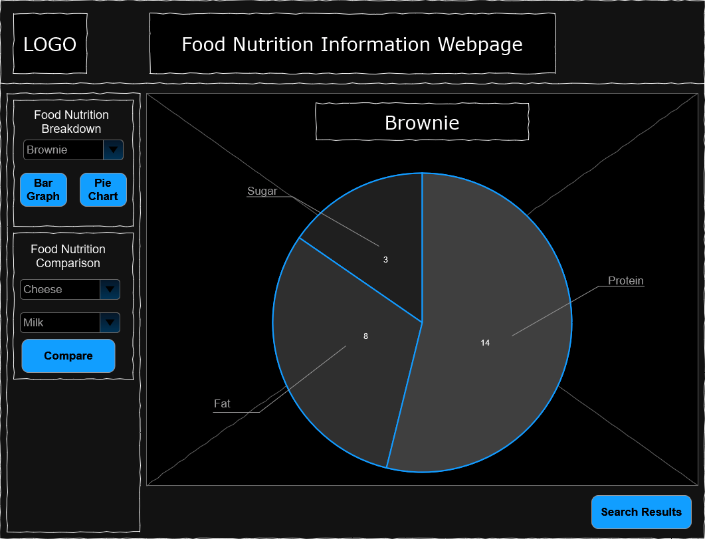
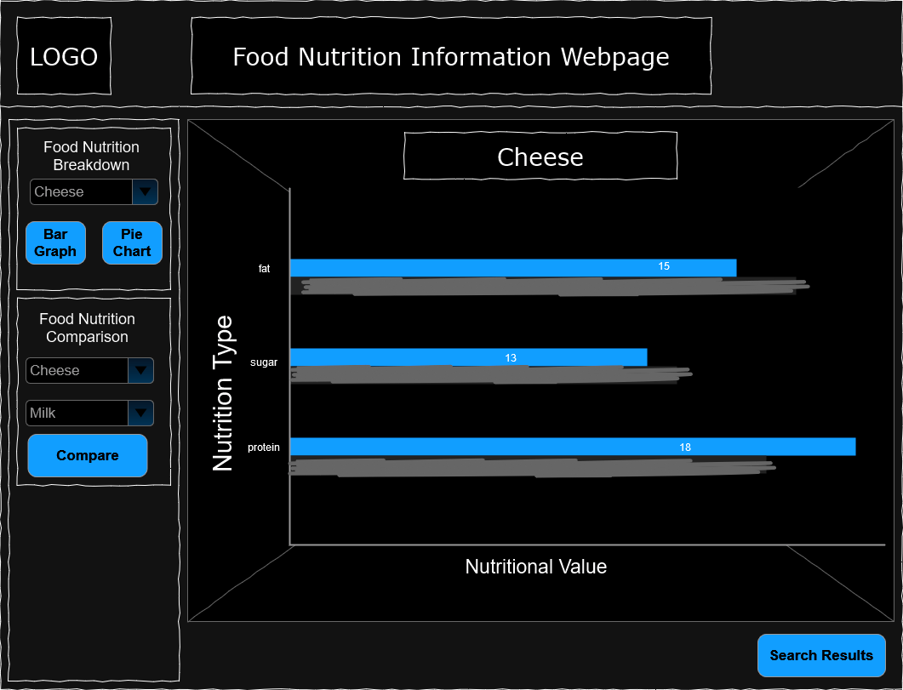
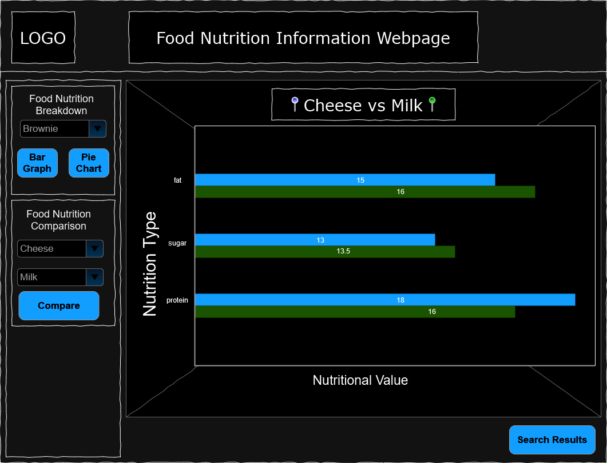

# Software Design Document

## Project Name: Food Nutrition Information Webpage
## Group Number: 85

## Team members

| Student Number | Name                     | 
|----------------|--------------------------|
| s5290101       | Ethan Weissel                |
| s5379918       | Atharav Verma                | 
| s2967734       | Jayden Alexander-Morpeth | 

# Table of Contents

<!-- TOC -->
* [Table of Contents](#table-of-contents)
  * [1. System Vision](#1-system-vision)
    * [1.1 Problem Background](#11-problem-background)
    * [1.2 System capabilities/overview](#12-system-capabilitiesoverview)
    * [1.3	Potential Benefits](#13potential-benefits)
  * [2. Requirements](#2-requirements)
    * [2.1 User Requirements](#21-user-requirements)
    * [2.2	Software Requirements](#22software-requirements)
    * [2.3 Use Case Diagrams](#23-use-case-diagrams)
    * [2.4 Use Cases](#24-use-cases)
  * [3.	Software Design and System Components](#3-software-design-and-system-components-)
    * [3.1	Software Design](#31software-design)
    * [3.2	System Components](#32system-components)
      * [3.2.1 Functions](#321-functions)
      * [3.2.2 Data Structures / Data Sources](#322-data-structures--data-sources)
      * [3.2.3 Detailed Design](#323-detailed-design)
  * [4. User Interface Design](#4-user-interface-design)
    * [4.1 Structural Design](#41-structural-design)
    * [4.2	Visual Design](#42visual-design)
<!-- TOC -->

## 1. System Vision

### 1.1 Problem Background

- The system aims to address the need for an efficient and user-friendly tool to analyze and visualize nutritional data. Many individuals, including nutritionists, health enthusiasts, and researchers, struggle with accessing and interpreting detailed nutritional information across various food items. This system simplifies this process by providing a comprehensive tool that allows users to search, filter, and visualize nutritional data, thereby supporting informed dietary decisions and nutritional research.

- Dataset: The system uses the Nutritional Food Database, a comprehensive dataset that includes detailed nutritional information for a wide range of food items commonly consumed globally. This dataset covers essential nutrients such as caloric value, fat content, carbohydrates, vitamins, minerals, and more, providing a holistic view of each food item’s nutritional profile.

- Data Input: Users will input specific food items, nutritional ranges, or select nutritional content levels to search, filter, and analyze the data. 
- Data Output: The system will output detailed nutritional information for searched food items, visualizations (such as pie charts and bar graphs) of nutrient breakdowns, and lists of foods that meet specified nutritional criteria.

- Target Users: The target users include:

-Nutritionists and Dietitians: To analyze food nutritional content for meal planning and dietary recommendations.

-Health Enthusiasts: To make informed decisions about their diet and nutrition.

-Researchers: To study nutritional content and correlations in dietary data for health and medical research.

-Educators and Students: For educational purposes, teaching and learning about nutrition and dietetics.

### 1.2 System capabilities/overview

#### - System Functionality: 
The system will function as a desktop application providing a graphical user interface (GUI) that allows users to interact with the Nutritional Food Database. The system will enable users to search for foods, view detailed nutritional breakdowns, filter foods based on nutritional ranges, and categorize foods by nutritional content levels.

#### - Features and Functionalities:

##### -Food Search:
Users can search for specific foods by name and retrieve all associated nutritional information.

##### -Nutrition Breakdown: 
Users can select a food item and view a visual breakdown of its nutritional content through pie charts and bar graphs.

##### -Nutrition Range Filter: 
Users can input a nutritional value range (e.g., protein content) to filter and display foods that fall within that range.

##### -Nutrition Level Filter: 
Users can categorize and filter foods based on predefined nutritional content levels (low, mid, high) for various nutrients like fat, protein, and carbohydrates.

##### -Additional Feature (TBD):
<mark style="background-color: #ff0000" >!Update: For this project the team decided that the feature that would present the most benefit to the user was a direct comparison tool. With this tool the user is able to directly compare the nutritional breakdown of a food entry compared to another.!</mark>
The team will propose and implement an additional feature to further enhance the tool’s functionality, such as comparing nutritional content between different foods or generating dietary recommendations based on user input.

### 1.3	Benefit Analysis
- Ease of Access: The system provides an accessible platform for users to quickly and easily obtain detailed nutritional information, reducing the complexity and time involved in manual data analysis.

- Enhanced Decision-Making: By visualizing nutritional data, the system aids users in making informed dietary choices, supporting better health outcomes.

- Educational Tool: The system serves as a valuable resource for learning about nutrition, making it useful for both personal education and formal teaching environments.

- Support for Research: Researchers can utilize the system to analyze nutritional data, identify trends, and support studies on diet and health, potentially leading to new insights and discoveries.

- Customization and Flexibility: With features like nutrition range filtering and level categorization, users can tailor their experience to their specific needs, whether for personal use, professional applications, or academic research.

## 2. Requirements

### 2.1 User Requirements

User Interaction: Users are expected to interact with the system through a graphical user interface (GUI). The interaction primarily involves:

1. Searching for Foods: Users will enter the name of a food item and receive all associated nutritional data.
2. Viewing Nutrition Breakdown: Users can select a food item to see detailed visualizations (pie charts, bar graphs) of its nutritional content.
3. Filtering by Nutrition Range: Users can input a minimum and maximum value for a specific nutrient and get a list of foods that meet the criteria.
4. Filtering by Nutrition Level: Users can categorize foods into low, mid, and high levels based on nutrient content.
5. Additional Feature Interaction: The users will have access to an additional feature that further enhances the analysis and visualization of nutritional data.
<mark style="background-color: #ff0000" >!Update: The final feature added to this project was the compare feature allowing users to directly compare to food items.!
#### Fictional User Persona:

- Name: Dr. Emily Stone
- Profession: Nutritionist
- Needs: Dr. Stone uses the system to analyze the nutritional content of various foods to provide dietary recommendations to her clients. She requires an easy-to-use tool that quickly filters foods based on specific nutrients and provides visual insights into their nutritional profiles.
#### Listing of User Needs:

- The system must allow users to quickly search for specific food items.
- The system should provide clear and concise visual representations of nutritional data.
- Users should be able to filter foods by specific nutrient ranges and levels.
- The system must support intuitive navigation and clear labeling of functionalities.
- Users should have access to additional features for in-depth analysis and comparison of food items.

### 2.2	Software Requirements
**R1.1** The system shall allow users to search for foods by name.

**R1.2** The system shall display all nutritional information associated with the searched food item.

**R1.3** The system shall provide pie charts and bar graphs to visualize the nutritional breakdown of selected foods.

**R1.4** The system shall enable users to filter food items by specifying a nutrient range (e.g., protein content between 10g and 20g).

**R1.5** The system shall categorize and filter foods into low, mid, and high levels for various nutrients like fat, protein, and carbohydrates.

**R1.6** The system shall allow users to access an additional feature for further analysis and visualization, such as comparing nutritional data across multiple food items.
<mark style="background-color: #ff0000" >!Update: R1.6 Became the compare feature.!

**R1.7** The system shall ensure data input and outputs are accurate and clear.

**R1.8** The system shall be hosted on a private GitHub repository with a track record of regular commits.

**R1.9** The system shall provide a user-friendly and responsive GUI.

### 2.3 Use Case Diagram

Use_Case_Diagram.jpg

### 2.4 Use Cases

| Use Case ID    | UC1                                                                                                                                                  |
|----------------|------------------------------------------------------------------------------------------------------------------------------------------------------|
| Use Case Name  | Search for Food                                                                                                                                      |
| Actors         | User (e.g., Nutritionist)                                                                                                                            |
| Description    | The user searches for a specific food item by name and retrieves all associated nutritional information.                                             |
| Flow of Events | - The user enters the name of the food item in the search bar. -The system retrieves and displays all nutritional data related to the food item. |
| Alternate Flow |If the food item is not found, the system notifies the user and suggests similar food items.                                                                                                                                               |

| Use Case ID    | UC2                                                                                                                                                                |
|----------------|--------------------------------------------------------------------------------------------------------------------------------------------------------------------|
| Use Case Name  | View Nutrition Breakdown                                                                                                                                           |
| Actors         | User (e.g., Health Enthusiast)                                                                                                                                     |
| Description    | The user selects a food item to view detailed visualizations of its nutritional content.                                                                           
                                                                                         |
| Flow of Events | -The user selects a food item from the search results. -The system generates pie charts and bar graphs showing the nutrient distribution of the selected food. |
| Alternate Flow | If no food is selected, the system prompts the user to select a food item.
                                                            |

| Use Case ID    | UC3                                                                                                                                            |
|----------------|------------------------------------------------------------------------------------------------------------------------------------------------|
| Use Case Name  | Filter by Nutrition Range                                                                                                                      |
| Actors         | User (e.g., Researcher)                                                                                                                        |
| Description    | The user filters food items based on a specific nutrient range.                                                                                |
| Flow of Events | -The user inputs the minimum and maximum values for a nutrient. -The system displays a list of foods that fall within the specified range. |
| Alternate Flow | If no foods match the criteria, the system notifies the user.                                      |            

| Use Case ID    | UC4                                                                                                                                |
|----------------|------------------------------------------------------------------------------------------------------------------------------------|
| Use Case Name  | Filter by Nutrition Level                                                                                                          |
| Actors         | User (e.g., Educator)                                                                                                              |
| Description    | The user categorizes and filters food items by low, mid, and high nutrient levels.                                                 |
| Flow of Events | -The user selects a nutrient and a level (low, mid, high). -The system displays a list of foods that match the selected level. |
| Alternate Flow | If no foods match the level, the system provides feedback.                           |

| Use Case ID    | UC5                                                                                                                                                                                                                              |
|----------------|----------------------------------------------------------------------------------------------------------------------------------------------------------------------------------------------------------------------------------|
| Use Case Name  | Use Additional Feature                                                                                                                                                                                                           |
| Actors         | User (e.g., Nutritionist)                                                                                                                                                                                                        |
| Description    | The user accesses an additional feature, such as a comparison tool, for further analysis.                                                                                                                                        |
| Flow of Events | -The user selects the additional feature from the menu.  -The system prompts the user to input the necessary parameters (e.g., selecting multiple food items for comparison). -The system displays the analysis results. |
| Alternate Flow | If the input is invalid, the system prompts the user to correct the input.                                                                                                                       |

## 3.	Software Design and System Components 

### 3.1	Software Design

Software_Design.drawio.png

### 3.2	System Components

#### 3.2.1 Functions

**1 def LoadData**
 - The purpose of this function is to read the Nutritional Food Database into the software, and store the data within as objects/dictionary.
 - The input for this function is the name of the data file, in this case we only deal with a single file so the input is static.
 - upon completion, the function will return a full dictionary containing all the food item names, and within each food item it will have the nutrition type, and each nutrition type will have a value.
 - Should the function not be able to run, whether due to software error, lack of resources or a missing file, the program itself will not be able to function properly.

**2 def FoodSearch**
 - This function is responsible for sorting through the dictionary where the food items are stored, and checking whether a food item name matches what the user has input into the food search text input.
 - this function will take the foodSearchTextbox as an input. The input will have a string value, and will be used to check for matches when sorting through food item names.
 - Upon completion, the program will return a dictionary, food_search_filtered, containing food items that contained the keyword the user provided. The structure of the dictionary will be the same as the one used to store all food items. It will contain the food item name, the nutrition types and the nutritional values.
 - Each time this function is run, the food_search_filtered variable will be overwritten.

**3 def NutritionBreakdown**
 - For this function, its purpose will be to draw pie charts and graphs for the food item the user has selected. This will happen when the user presses a button while having a food item selected, or when they select the pie chart or graph button in the graph area itself.
 - For the input, the function will take the food item name and the graph type. When a user has selected a button, either pie chart or graph, this will be used to determine the type of graph that is generated. food name as well as button pressed will be input as a string. By default, when generating the graph breakdown area, it will be blank until the user selects a food type and graph to be displayed. When taking the food name as an input, it will then check the global variable where the food is stored with their nutritional information to be used to generate the graph.
 - Upon the function being completed, it will return a graph to be displayed in the information display area.
 - When the graph is created, the information display area for nutrition breakdown will now by default have a graph displayed, instead of being a blank area.

**4 def RangeFilter**
 - This function will be used when the Range Filter option has been enabled. It will take several user inputs to act as a filter when displaying food item search results.
 - As for the inputs, first the user will need to select a nutrition type. This will appear to the user as a dropdown list, and will be input into the function as a string. The user will also need to input values into the minimum and maximum field, which will be read into the function as integers. These will be used when filtering to ensure that the nutritional values fall within both variables. Also, the function will take the previously generated search results as an input in the form of a dictionary.
 - Once the function has been run, a dictionary containing the filtered results will be returned. The dictionary will contain the food item names, the nutritional types and their values.
 - As a result of this function being run, the current search result dictionary will be changed to reflect any filtering done by this function.

**5 def NutritionLevel**
- the purpose of this function is to allow a user to select a type of nutritional value from a dropdown list(fat, protein, carbohydrates, sugar or nutritional density), and then select one of three options, low, medium or high, and have the search results filtered by these decisions.
- First, the function will take the current search results as an input, it will be in the form of a dictionary, containing the food item name, nutritional types and their values. Next will be the nutrition type selected by the user, in the form of a string. Finally, depending on the type of nutritional level selected, either 'low', 'medium' or 'high' will be taken as an input for the level variable in the form of a string. Altogether, the dictionary input will be looped through, and each nutritional value selected by the user will be calculated into a total value. Once this has been done, a second loop through of the dictionary will be done, and depending on whether the user selected low, medium or high, the value of an items nutritional value will be compared to the overall average, and only results that pass the requirement will be added to a new dictionary.
- Once the function has run its course, a new dictionary with search results will be returned to be displayed.
- As a result of this function being run, the current search results variable will be changed.
<mark style="background-color: #ff0000" >!Update: Changed name of filter to LevelFilter, this sticks to a closer naming convention and was slightly easier to differentiate.!

**6 def FoodComparison**
- The purpose of this function is to allow the user to compare two different food items.
- The function will take two strings as the input, the name of the first food item to be compared, and the name of the second food item to be compared. These two names will be used to sort through the global food storage dictionary and pull back the nutritional data for the two selected food types.
- Upon the function being completed, the plotting for a bar graph will be returned.
- Upon this function being completed, the current graph being displayed will be removed and placed with the new graph.

#### 3.2.2 Data Structures / Data Sources

**Food_list**
- Type: Dictionary
- Usage: This will be used constantly in the program. It is responsible for acting as the main storage location of the imported list of food items and their attributes. It will be used when displaying results to the user, when filtering said results.
- Functions: This list will be utilised by the FoodSearch function.

**Food_filtered**
- Type: Dictionary
- Usage: This dictionary will be used for filtered results. It is what will be ultimately printed out to the user after going through a series of functions.
- Functions: As for the functions themselves, first is the FoodSearch function, after any keywords are compared with the list of food items, they will be added to this data structure. Then, if the user has enabled the range filter or nutrition level feature, they will also utilise this data, and update it based on user inputs.

**Food_Current**
- Type: Dictionary
- Usage: This will be used when the user wants to have a look at the nutritional breakdown of a particular food. The food name item, nutritional types and their values will be used to generate graphs.
- Functions: This data will be utilised by the NutritionBreakdown function. When the user selects a food item and presses the button to generate a graph, it will take the food item dictionary as an input.

#### 3.2.3 Detailed Design

Detailed_Design_Flowchart.drawio.png

## 4. User Interface Design

### 4.1 Structural Design

Structural_Design.drawio.png

- Structure: The software will be structured into 4 main components. The header, filtering, information display and Footer. The header will be where the program logo and program name will be displayed. The information display is where the bulk of information will be, Search results when the user searches for food, and different graphs when the user either wants to compare a single foods nutrients against each other, or the nutrients of two foods against each other. The filtering section will be where most of the user input features are, allowing them to search for food, filter for foods with specific nutritional values, or see which foods fall within the low, medium or high averages of specific nutrients. Once the user has selected all the relevant filters, they can then press the search button. The footer is where the navigation will take place, since there will be plenty of search results, the user will need to be able to navigate through them all. The footer also contains a button which will allow the user to access the nutrition breakdown function.

- Information Grouping: By default, information is organized based on the default order in the dataset provided, which will be printed out in sequential order in the information display. However, through the use of the filtering functions, the way the information is displayed will be changed, eliminating results that do not meet the criteria set by the user. Furthermore, the user will be able to have some of the information shown as a graph.

- Navigation: For navigation, there are a few elements. firstly, should the user wish to navigate through the different results, there will be buttons below the search results that will let them change pages and see different food types. Secondly is the nutrition breakdown button, which will change the information display area from the search results to the graph breakdown. Finally, while the user is in the graph breakdown screen, they can press the search results button to return to the main information display showcasing different food types.

- Design Choices: For the design, the main aim was to maximize the amount of area available for the information display, as there will be a large quantity of data that needs to be displayed without reducing legibility. In line with his, rather than having the search results and graphs share the same screen, it was necessary to provide separate areas for these to be displayed. It was also necessary to ensure that the filtering section received enough room, although the user won't need to input a lot of information, up to a few words for a food type, and no more than 4 numbers for the nutrition values, 
<mark style="background-color: #ff0000" >!Update: A small change was made with the moving of the nutrition breakdown button to underneath the search feature and the level filter being horizontally split rather than vertically. The button was moved to make all the buttons located in the one area simplifying the navigating and filtering features layout. Still the original 4 main components design was kept intact.
### 4.2	Visual Design

Program_homepage_mockup.drawio.png

!Update: Due to the changes mentioned above the final products main page varies slightly from the wireframe. Overall the product is the same with the displayed data still being the key aspect displayed on screen.

This wireframe showcases the main screen the user will be interacting with in the program. Here, the user can search for different food types, and utilise the various filtering functions to further refine what they are looking for. Since the search results are the most important part of what the user is after, it occupies the most space in the design overlay. Whilst not fully captured in the wireframe, there will be around 34 different types of nutrients for every food item, so it is necessary to make sure there is enough space to display the values for each of these nutrition types, whilst making it legible for the user. For now, due to limitation with the wireframe mockup, I have not been able to truly convey whether such a format will be possible, and such issues will need to be tackled during software development.

As for the top of the screen, a modest amount of space has been dedicated to showcase the name of the program, as well as make space for a logo. Whilst space is premium when trying to fit in a lot of data, it is still important to advertise the program for anyone that sees the data the program provides, whether as a passerby or from screenshots.

For the left side of the interface, all the features have been fit snugly into a general area. Firstly is the food search bar, where the user will be able to enter a food item name, such as 'cheese'. This element doesn't need to be too big, as it is meant to only allow for the searching of a single food item, not multiple. For the Nutrition Range Filter, slightly more space was required but thanks to drop down boxes, a lot of space is saved. The dropdown itself needs to allow the user to select from any of the 34? different nutrition types for filtering. Once the user has selected their nutrition type, they can then type in a numerical value for the minimum and maximum section. Ideally, these two would be side by side in the program itself, with a dash between them, such that it would appear as so; [minimum] - [maximum]. However, due to the constraints of the tool available, the text boxes could not be fit side by side without hiding the text elements due to an unremovable search icon that has been scribbled out. Finally [not finally], is the Nutrition Level Filter. To help differentiate from the previous function, this one utilises unique radial buttons for each part. The user can only select a single nutrition type that they would like to act as a filter. Once the user has selected a type, they can then select the level at which they would like to filter at. From a first glance the user may not understand what each level represent when searching, so a help button or some form of additional information may be required. Should space be required, the prior nutrition types can also be relegated to a dropdown box.

Under the search results are the navigation and nutrition breakdown. The navigation will be used to page through the search results, each page will contain 10 results to ensure legibility. This can be easily changed in the future should it be discovered that more space is available than previously perceived, but for now 10 seemed to act as a fair number. On the bottom right is one of the other main functions of the program, the nutrition breakdown. When the user presses this button, the search results and filtering section will be replaced with new options to generate a graph showcasing nutrient compositions of foods and to make comparison between different foods.

program_pie_chart.drawio.png

!Update: The Pie chart was changed to have a legend instead of each slice being labeled individually. This was due to how small of a percentage the micro nutrients are in compared with the macros. Due to this is was difficult to differentiate labels for each part. Ultimately the legend allows users to see the exactly breakdown without becoming confused about which label represents what.

For the most part the program interface stays the same, the only area that is changed is the search results and the filtering section.

for the graph itself, the pie chart takes center stage, with the food item name in clear bold writing above it. Each slice of the pie will have a label stating what the nutrition type is, and depending on how the pie looks when fed with 34 different types of data, it may even show the value on the slice itself. On the left side of the screen are the nutrition breakdown and nutrition comparison section. From here, the user can select the food they wish to breakdown from a dropdown list, and then choose the type of graph to generate, either a bar graph or pie chart. As can be seen in this wireframe and the next one, the graph itself will take center stage. For the nutrition comparison, the user will need to select two different food types, and will not be able to select the graph type, as a pie chart would not be able to convey the comparison as well as a bar graph would. Finally, once the user is done admiring the pie chart, they can select the search results button, which has taken the place of the nutrition breakdown button to return back to the search results, hopefully on the same page they were on.

program_bar_graph.drawio.png

!Update: The bar chart was changed to a vertical bar chart to allow the user an easy time seeing all of the nutrients at once. This design choice only impacted the end product minimally.

Not much has changed with the bar graph as opposed to the pie chart, except for the graph itself. For the graph, the X axis will represent the nutritional values, Y value will represent the different nutrition types. Each bar on the graph will be labeled with their nutrition type, and should there be enough space, each bar will also be accompanied by their value.

program_comparison_graph.drawio.png

!Update: Same as the bar graph the comparison was change to a vertical layout. The values are also represented above the lines due to some being extremely small and not having the ability to fit within.

Overall same layout as the bar graph, but instead of each nutrition only having a single bar, there will instead be two. The two results will have different colours to help set them apart, and these two colours will be mentioned above the graph so the user will know what data represents what food. The name above the graph as well will mention both foods.

