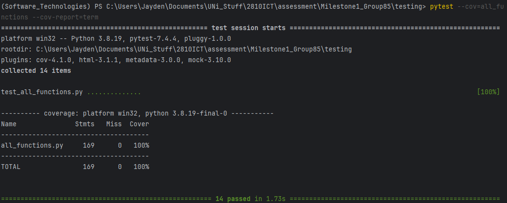
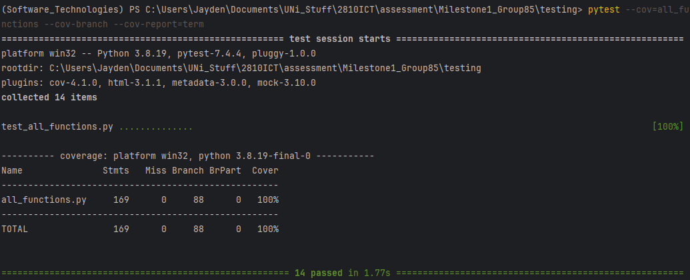

# Coverage Testing Report

Please provide your GitHub repository link.
### GitHub Repository URL: https://github.com/EthanWeissel/Milestone1_Group85.git

---

## 1. **Test Summary**

| **Tested Functions** |
|----------------------|
| `def tableSearch(self, input_text)` |
| `def onPlotBar(self, user_input)`      |
| `def onPlotPie(self, user_input)`        |
| `def onCompare(self, input_1, input_2)`     |
| `def rangeFilter(self, input_1, input_2, input_3)`    |
| `def levelFilter(self)`        |

---

## 2. **Statement Coverage Test**

### 2.1 Description

Test cases were designed through iteration. Test cases were made, run, and at the end checked to ensure that the tests made covered all statements. Although we attempted to make sure we did this before designing tests, checking that we did afterwards to ensure coverage was vital. If we in fact missed anything, we could go back and redesign a test or make a new one to ensure coverage.

### 2.2 Testing Results

## 3. **Branch Coverage Test**

### 3.1 Description

First, we ran the coverage test and monitored to see what lines in the code were executed. After this, we analysed the code and branch coverage output to determine what lines were run, and which ones were not. having the report in a html format to view which parts of the code were not run was extremely helpful for this part of the process. Once we determined the parts of the code that did not run, we re-coded the unit tests, adding additional cases where necessary, then went back to square one, test, analyse, recode.

### 3.2 Testing Results

