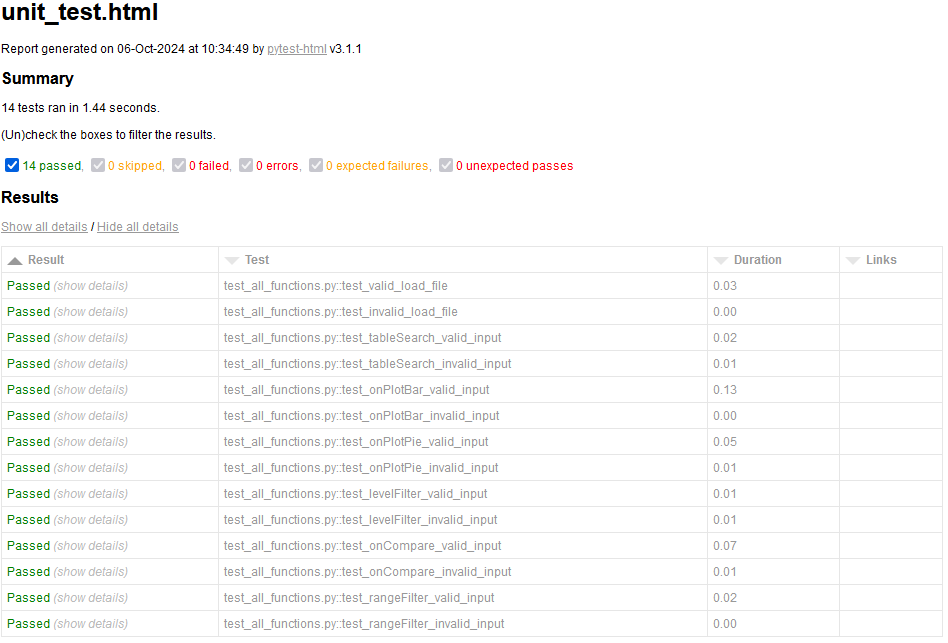

# Unit Testing Report

### GitHub Repository URL: https://github.com/EthanWeissel/Milestone1_Group85.git

---


## 1. **Test Summary**


| **Tested Functions** | **Test Functions**                                                                                                                                       |
|----------------------|----------------------------------------------------------------------------------------------------------------------------------------------------------|
| `def tableSearch(self, input_text)`        | `test_tableSearch_valid_input()` <br> `test_tableSearch_invalid_input()` |
| `def onPlotBar(self, user_input)`      | `def test_onPlotBar_valid_input()` <br> `def test_onPlotBar_invalid_input()` |
| `def onPlotPie(self, user_input)`         | `def test_onPlotPie_valid_input()` <br> `def test_onPlotPie_invalid_input()` |
| `def onCompare(self, input_1, input_2)`        | `def test_onCompare_valid_input()` <br> `def test_onCompare_invalid_input()` |
| `def rangeFilter(self, input_1, input_2, input_3)`        | `def test_rangeFilter_valid_input()` <br> `def test_rangeFilter_invalid_input()` |
| `def levelFilter(self)`        | `def test_levelFilter_valid_input()` <br> `def test_levelFilter_invalid_input()` |
---

## 2. **Test Case Details**

### Test Case 1:
- **Test Function/Module**
  - `test_tableSearch_valid_input()`
  - `test_tableSearch_invalid_input()`
- **Tested Function/Module**
  - `def tableSearch(self, input_text)`
- **Description**
  - The purpose of the tested function is to take the user input when searching the database, filter the database for food items with a matching name, and output a new dataframe containing foods containing the user input.
- **1) Valid Input and Expected Output**  

| **Valid Input**                                      | **Expected Output**                          |
|------------------------------------------------------|----------------------------------------------|
| `frame.tableSearch("apple")`                               | `dataframe containg result 'apple'`          | 
| `frame.tableSearch("apple")`              | `dataframe containing result 'pineapple'`    |
| `frame.tableSearch("")`        | `dataframe containg all results`             |
| `frame.tableSearch("Apple")`  | `dataframe containing result 'Apple'`        | 
| `frame.tableSearch("           cooking wine            ")` | `dataframe containing result 'cooking wine'` |

- **1) Code for the Test Function**
```python
# Setup
    frame = MyMainFrame()  # Initialize the frame
    test_input_1 = "apple"  # Valid food item
    test_input_2 = ""       #no input
    test_input_3 = "Apple"  #capitalised valid food item
    test_input_4 = "           cooking wine            "

    # Execution
    result_1 = frame.tableSearch(test_input_1)
    result_2 = frame.tableSearch(test_input_2)
    result_3 = frame.tableSearch(test_input_3)
    result_4 = frame.tableSearch(test_input_4)

    # Expected result: dataframe returned will contain 30 results
    expected_result_1 = 30
    # Expected result: dataframe returned will contain apple data
    expected_result_2 = "apple"
    # Expected result: dataframe returned will contain pineapple data
    expected_result_3 = "pineapple"
    # Expected result: dataframe returned will match unfiltered dataframe
    expected_result_4 = frame.df
    # Expected result: dataframe returned will contain capitalised food names
    expected_result_5 = "Apple"
    # Expected result: dataframe returned will contain cooking wine data
    expected_result_6 = "cooking wine"


    # Assertion
    assert len(result_1) == expected_result_1, f"expected {expected_result_1} results, but got {len(result_1)}"
    assert expected_result_2 in result_1["food"].values
    assert expected_result_3 in result_1["food"].values
    assert len(result_2) == len(expected_result_4), f"expected {len(expected_result_4)} results, but got {len(result_2)}"
    assert expected_result_5 in result_3["food"].values
    assert expected_result_6 in result_4["food"].values
```
- **2) Invalid Input and Expected Output**

| **Invalid Input**             | **Expected Output** |
|-------------------------------|---------------------|
| `frame.tableSearch("123")` | `Handle Exception`     |
| `frame.tableSearch("kerfluffle")` | `Handle Exception`     |
| `frame.tableSearch("&*^(*()")` | `Handle Exception`     |
| `frame.tableSearch(["apple", "pineapple"])` | `Handle Exception`     |
| `frame.tableSearch("Kerfluffle")` | `Handle Exception`     |

- **2) Code for the Test Function**
```python
def test_tableSearch_invalid_input():
    frame = MyMainFrame()

    with pytest.raises(ValueError) as exc_info:
        input = "123"
        result = frame.tableSearch(input)
    assert exc_info.type is ValueError

    with pytest.raises(ValueError) as exc_info:
        result = frame.tableSearch("kerfluffle")
    assert exc_info.type is ValueError

    with pytest.raises(ValueError) as exc_info:
        result = frame.tableSearch("&*^(*()")
    assert exc_info.type is ValueError

    with pytest.raises(ValueError) as exc_info:
        result = frame.tableSearch(["apple", "pineapple"])
    assert exc_info.type is ValueError

    with pytest.raises(ValueError) as exc_info:
        result = frame.tableSearch("Kerfluffle")
    assert exc_info.type is ValueError
```
### Test Case 2.1:
- **Test Function/Module**
  - `test_onPlotBar_valid_input()`
  - `test_onPlotBar_invalid_input()`
- **Tested Function/Module**
  - `frame.onPlotBar(input_data)`
- **Description**
  - The purpose of the function is the create a bar graph, it takes as an input a food item name, and as an output creates a bar graph plot.
- **1) Valid Input and Expected Output**  

| **Valid Input**               | **Expected Output** |
|-------------------------------|---------------------|
| `frame.onPlotBar("apple")`               | `["Nutrient", "Value"]`                 |

- **1) Code for the Test Function**
```python
def test_onPlotBar_valid_input():
    # Setup
    frame = MyMainFrame()  # Initialize the frame
    input_data = "apple"  # Valid food item

    # Execution
    result = frame.onPlotBar(input_data)

    # Expected result: Bar chart showing nutritional values of "apple"
    expected_columns = ["Nutrient", "Value"]  # Example column names for the plot data

    # Assertion
    assert result is not None, "Expected a bar chart, but got None."
    assert all(col in result.columns for col in
               expected_columns), f"Expected columns {expected_columns}, but got {result.columns}"

```
- **2) Invalid Input and Expected Output**

| **Invalid Input**             | **Expected Output** |
|-------------------------------|---------------------|
| `frame.onPlotBar("kerfluffle")` | `Handle Exception`  |
| `frame.onPlotBar("")`  | `Handle Exception`  |

- **2) Code for the Test Function**
```python
def test_onPlotBar_invalid_input():
    # Setup
    frame = MyMainFrame()  # Initialize the frame
    input_data = "kerfluffle"  # Invalid food item

    # Execution and Assertion
    with pytest.raises(ValueError) as exc_info:
        frame.onPlotBar(input_data)

    # Expected result: Raise ValueError or similar error
    assert str(
        exc_info.value) == "No data found for 'kerfluffle'", f"Expected ValueError for invalid input, but got {exc_info.value}"

    input_data = ""

    # Execution and Assertion
    with pytest.raises(ValueError) as exc_info:
        frame.onPlotBar(input_data)

    # Expected result: Raise ValueError or similar error
    assert str(
        exc_info.value) == "No Food Selected.", f"Expected ValueError for invalid input, but got {exc_info.value}"

```
### Test Case 2.2:
- **Test Function/Module**
  - `test_onPlotPie_valid_input()`
  - `test_onPlotPie_invalid_input()`
- **Tested Function/Module**
  - `frame.onPlotPie(input_data)`
- **Description**
  - The purpose of this function is to draw a pie chart, to draw the chart it will take the users input food name, search the dataframe for a match, then output a plotted graph to be drawn on the canvas.
- **1) Valid Input and Expected Output**  

| **Valid Input**               | **Expected Output** |
|-------------------------------|---------------------|
| `frame.onPlotPie("banana")`   | `["Nutrient", "Value"]`|

- **1) Code for the Test Function**
```python
def test_onPlotPie_valid_input():
    # Setup
    frame = MyMainFrame()  # Initialize the frame
    input_data = "banana"  # Valid food item

    # Execution
    result = frame.onPlotPie(input_data)

    # Expected result: Pie chart showing nutritional breakdown of "banana"
    expected_columns = ["Nutrient", "Value"]  # Example column names for the plot data

    # Assertion
    assert result is not None, "Expected a bar chart, but got None."
    assert all(col in result.columns for col in
               expected_columns), f"Expected columns {expected_columns}, but got {result.columns}"

```
- **2) Invalid Input and Expected Output**

| **Invalid Input**             | **Expected Output** |
|-------------------------------|---------------------|
| `frame.onPlotPie("unknown_food")` | `Handle Exception`  |
| `frame.onPlotPie("")` | `Handle Exception`     |

- **2) Code for the Test Function**
```python
def test_onPlotPie_invalid_input():
    # Setup
    frame = MyMainFrame()  # Initialize the frame
    input_data = "unknown_food"  # Invalid food item

    # Execution and Assertion
    with pytest.raises(ValueError) as exc_info:
        frame.onPlotPie(input_data)

    # Expected result: Raise ValueError or appropriate error
    assert str(
        exc_info.value) == "No data found for 'unknown_food'", f"Expected ValueError for invalid input, but got {exc_info.value}"

    input_data = ""

    # Execution and Assertion
    with pytest.raises(ValueError) as exc_info:
        frame.onPlotPie(input_data)

    # Expected result: Raise ValueError or similar error
    assert str(
        exc_info.value) == "No Food Selected.", f"Expected ValueError for invalid input, but got {exc_info.value}"

```


### Test Case 3:
- **Test Function/Module**
  - `test_rangeFilter_valid_input()`
  - `test_rangeFilter_invalid_input()`
- **Tested Function/Module**
  - `frame.rangeFilter(input_1, input_2, input_3)`
- **Description**
  - this function filters the search results, it does so by taking a nutrient type, minimum value, and maximum value as an input from the user, then the existing filtered dataframe, then outputs a new filtered dataframe.
- **1) Valid Input and Expected Output**  

| **Valid Input**                         | **Expected Output**                                                               |
|-----------------------------------------|-----------------------------------------------------------------------------------|
| `frame.rangeFilter("2", "3", "Sugars")` | `dataframe only containing food items with a Sugar content value between 2 and 3` |
| `frame.rangeFilter("", "3", "Sugars")`  | `dataframe only containing food items with a maximum Sugar content value of 3`    |
| `frame.rangeFilter("3", "", "Sugars")`  | `dataframe only containing food items with a minimum Sugar content value of 3`    |

- **1) Code for the Test Function**
```python
def test_rangeFilter_valid_input():
    # Setup
    frame = MyMainFrame()  # Initialize the frame
    test_1_input_1 = "2"  # Valid minimum input
    test_1_input_2 = "3" #valid maximum input
    test_1_input_3 = "Sugars" #valid nutriton type

    # Execution
    result_1 = frame.rangeFilter(test_1_input_1, test_1_input_2, test_1_input_3)

    # Expected result: Comparison chart showing nutritional values of both "apple" and "banana"
    expected_result_1 = 102  # Example columns for the comparison chart

    # Assertion
    assert result_1 is not None, "Expected a dataframe chart, but got None."
    assert len(result_1) == expected_result_1, f"expected {expected_result_1} results, but got {len(result_1)}"

    # Setup
    frame = MyMainFrame()  # Initialize the frame
    test_2_input_1 = ""  # Valid minimum input
    test_2_input_2 = "3"  # valid maximum input
    test_2_input_3 = "Sugars"  # valid nutriton type

    # Execution
    result_2 = frame.rangeFilter(test_2_input_1, test_2_input_2, test_2_input_3)

    # Expected result: Comparison chart showing nutritional values of both "apple" and "banana"
    expected_result_2 = 1777  # Example columns for the comparison chart

    # Assertion
    assert result_2 is not None, "Expected a dataframe chart, but got None."
    assert len(result_2) == expected_result_2, f"expected {expected_result_2} results, but got {len(result_2)}"

    # Initialize the frame
    test_3_input_1 = "3"  # Valid minimum input
    test_3_input_2 = ""  # valid maximum input
    test_3_input_3 = "Sugars"  # valid nutriton type

    # Execution
    result_3 = frame.rangeFilter(test_3_input_1, test_3_input_2, test_3_input_3)

    # Expected result: Comparison chart showing nutritional values of both "apple" and "banana"
    expected_result_3 = 627  # Example columns for the comparison chart

    # Assertion
    assert result_2 is not None, "Expected a dataframe chart, but got None."
    assert len(result_3) == expected_result_3, f"expected {expected_result_3} results, but got {len(result_3)}"

```
- **2) Invalid Input and Expected Output**

| **Invalid Input**                                    | **Expected Output** |
|------------------------------------------------------|---------------------|
| `frame.rangeFilter("strawberries", "123", "Sugars")` | `Handle Exception`  |
| `frame.rangeFilter("123", "strawberries", "Sugars")` | `Handle Exception`  |
| `frame.rangeFilter("", "", "Sugars")`                | `Handle Exception`  |
| `frame.rangeFilter("1", "2", "123")`                 | `Handle Exception`  |
| `frame.rangeFilter("1", "2", "")`                    | `Handle Exception`  |
| `frame.rangeFilter("1", "2", "Sug@rs")`              | `Handle Exception`  |
| `frame.rangeFilter("1", "2", 123)`                   | `Handle Exception`  |

- **2) Code for the Test Function**
```python
def test_rangeFilter_invalid_input():
    frame = MyMainFrame()

    with pytest.raises(ValueError) as exc_info:
        input_1 = "strawberries"
        input_2 = "123"
        input_3 = "Sugars"
        result = frame.rangeFilter(input_1, input_2, input_3)
    assert exc_info.type is ValueError

    with pytest.raises(ValueError) as exc_info:
        input_1 = "123"
        input_2 = "strawberries"
        input_3 = "Sugars"
        result = frame.rangeFilter(input_1, input_2, input_3)
    assert exc_info.type is ValueError

    with pytest.raises(ValueError) as exc_info:
        input_1 = ""
        input_2 = ""
        input_3 = "Sugars"
        result = frame.rangeFilter(input_1, input_2, input_3)
    assert exc_info.type is ValueError

    with pytest.raises(ValueError) as exc_info:
        input_1 = "1"
        input_2 = "2"
        input_3 = "123"
        result = frame.rangeFilter(input_1, input_2, input_3)
    assert exc_info.type is ValueError

    with pytest.raises(ValueError) as exc_info:
        input_1 = "1"
        input_2 = "2"
        input_3 = ""
        result = frame.rangeFilter(input_1, input_2, input_3)
    assert exc_info.type is ValueError

    with pytest.raises(ValueError) as exc_info:
        input_1 = "1"
        input_2 = "2"
        input_3 = "Sug@rs"
        result = frame.rangeFilter(input_1, input_2, input_3)
    assert exc_info.type is ValueError

    with pytest.raises(ValueError) as exc_info:
        input_1 = "1"
        input_2 = "2"
        input_3 = 123
        result = frame.rangeFilter(input_1, input_2, input_3)
    assert exc_info.type is ValueError

```

### Test Case 4:
- **Test Function/Module**
  - `def test_levelFilter_valid_input():`
  - `def test_levelFilter_invalid_input():`
- **Tested Function/Module**
  - `frame.levelFilter(mock_nutritionType, mock_nutritionLevel)`
- **Description**
  - The test function filters different nutrition types into 3 seperate ranges or 
    levels. the first is all foods with a value 66% or higher than the maximum value. The Second is between 33% and 66% of the
    maximum value. Finally the third is all foods with a value 33% or lower than the maximum value.
- **1) Valid Input and Expected Output**  

| **Valid Input**                        | **Expected Output**                                            |
|----------------------------------------|----------------------------------------------------------------|
| `frame.levelFilter("Sugar", "Low")`    | `All mock data rows where Protein content is considered "Low".` |
| `frame.levelFilter("Sugar", "Medium")` | `Mock data rows where Sugar content is considered "Medium".`   |
| `frame.levelFilter("Sugar", "High")`   | `All with mock data rows where Carbohydrates content is "High"`  |

- **1) Code for the Test Function**
```python
def test_levelFilter_valid_input():
    # Test 1: Valid Low input
    frame = MyMainFrame()  # Initialize the frame
    frame.filtered_df = pd.DataFrame({
        'Sugars': [100, 200, 300, 400, 500],
    })
    frame.m_nutritionType = Mock()
    frame.m_nutritionType.GetStringSelection.return_value = 'Sugars'
    frame.m_nutritionLevel = Mock()
    frame.m_nutritionLevel.GetStringSelection.return_value = 'Low'

    expected_df_low = frame.filtered_df[frame.filtered_df['Sugars'] < 500 * 0.33]
    result_low = frame.levelFilter()
    pd.testing.assert_frame_equal(result_low, expected_df_low)

    # Test 2: Valid Medium input
    frame.m_nutritionLevel.GetStringSelection.return_value = 'Medium'
    expected_df_medium = frame.filtered_df[
        (frame.filtered_df['Sugars'] >= 500 * 0.33) & (frame.filtered_df['Sugars'] <= 500 * 0.66)
        ]
    result_medium = frame.levelFilter()
    pd.testing.assert_frame_equal(result_medium, expected_df_medium)

    # Test 3: Valid High input
    frame.m_nutritionLevel.GetStringSelection.return_value = 'High'
    expected_df_high = frame.filtered_df[frame.filtered_df['Sugars'] > 500 * 0.66]
    result_high = frame.levelFilter()
    pd.testing.assert_frame_equal(result_high, expected_df_high)
```
- **2) Invalid Input and Expected Output**

| **Invalid Input**             | **Expected Output** |
|-------------------------------|---------------------|
| `frame.levelFilter("InvalidType", "InvalidLevel")`               | `Raises ValueError: "Invalid nutrition type selected: InvalidType and Invalid nutrition level selected: InvalidLevel".`  |
| `frame.levelFilter("Protein", "InvalidLevel")` | `Raises ValueError: "Invalid nutrition level selected: InvalidLevel".'`               |
| `frame.levelFilter("InvalidType", "InvalidLevel")` | `Raises ValueError: "Invalid nutrition type selected: InvalidType and Invalid nutrition level selected: InvalidLevel".`               |

- **2) Code for the Test Function**
```python
def test_levelFilter_invalid_input():
    frame = MyMainFrame()
    frame.filtered_df = pd.DataFrame({
        'Sugars': [10, 250, 300, 400, 500],
    })

    # test 1 - both type and level are invalid
    frame.m_nutritionType = Mock()
    frame.m_nutritionType.GetStringSelection.return_value = 'InvalidType'
    frame.m_nutritionLevel = Mock()
    frame.m_nutritionLevel.GetStringSelection.return_value = 'Invalid'

    with pytest.raises(ValueError) as exc_info:
        frame.levelFilter()

    # error message for both invalid options
    assert str(exc_info.value) == "Invalid nutrition type selected: InvalidType and Invalid nutrition level selected: Invalid", \
        f"Unexpected exception: {exc_info.value}"

    # the type is wrong but the level is right
    frame.m_nutritionType.GetStringSelection.return_value = 'InvalidType'
    frame.m_nutritionLevel.GetStringSelection.return_value = 'Low'

    with pytest.raises(ValueError) as exc_info:
        frame.levelFilter()

    # error message for invalid type
    assert str(exc_info.value) == "Invalid nutrition type selected: InvalidType", \
        f"Unexpected exception: {exc_info.value}"

    # type is correct but the level is wrong
    frame.m_nutritionType.GetStringSelection.return_value = 'Sugars'
    frame.m_nutritionLevel.GetStringSelection.return_value = 'Invalid'

    with pytest.raises(ValueError) as exc_info:
        frame.levelFilter()

    # error message for only invalid level
    assert str(exc_info.value) == "Invalid nutrition level selected: Invalid", \
        f"Unexpected exception: {exc_info.value}"
```


### Test Case 5:
- **Test Function/Module**
  - `test_onCompare_valid_input()`
  - `test_onCompare_invalid_input()`
- **Tested Function/Module**
  - `frame.onCompare(input_data1, input_data2)`
- **Description**
  - This function is used to draw a graph from two sets of data to compare them, it will take two food names as an input, and output a plotted bar chart.
- **1) Valid Input and Expected Output**  

| **Valid Input**               | **Expected Output** |
|-------------------------------|---------------------|
| `frame.onCompare("apple", "Banana")`| `["Nutrient", "Apple Value", "Banana Value"]`  |

- **1) Code for the Test Function**
```python
def test_onCompare_valid_input():
    # Setup
    frame = MyMainFrame()  # Initialize the frame
    input_data1 = "apple"  # First valid food item
    input_data2 = "banana"  # Second valid food item

    # Execution
    result = frame.onCompare(input_data1, input_data2)

    # Expected result: Comparison chart showing nutritional values of both "apple" and "banana"
    expected_columns = ["Nutrient", "Apple Value", "Banana Value"]  # Example columns for the comparison chart

    # Assertion
    assert result is not None, "Expected a comparison chart, but got None."
    assert all(col in result.columns for col in
               expected_columns), f"Expected columns {expected_columns}, but got {result.columns}"

```
- **2) Invalid Input and Expected Output**

| **Invalid Input**             | **Expected Output** |
|-------------------------------|---------------------|
| `frame.onCompare("kerfluffle", "bacon egg cheese smoothie")`| `Handle Exception`  |
| `frame.onCompare("", "")`| `Handle Exception`  |
| `frame.onCompare("kerfluffle", "apple")`| `Handle Exception`  |
| `frame.onCompare("apple", "kerfluffle")`| `Handle Exception`  |

- **2) Code for the Test Function**
```python
def test_onCompare_invalid_input():
    # Setup
    frame = MyMainFrame()  # Initialize the frame
    input_data1 = "kerfluffle"  # Invalid food item
    input_data2 = "bacon egg cheese smoothie"  # Another invalid food item

    # Execution and Assertion
    with pytest.raises(ValueError) as exc_info:
        frame.onCompare(input_data1, input_data2)

    # Expected result: Raise ValueError or appropriate error
    assert str(
        exc_info.value) == f"No data found for '{input_data1}' or '{input_data2}'", f"Expected ValueError for invalid input, but got {exc_info.value}"

    input_data1 = ""  # Invalid food item
    input_data2 = ""  # Another invalid food item

    # Execution and Assertion
    with pytest.raises(ValueError) as exc_info:
        frame.onCompare(input_data1, input_data2)

    # Expected result: Raise ValueError or appropriate error
    assert str(
        exc_info.value) == f"Both food items not selected.", f"Expected ValueError for invalid input, but got {exc_info.value}"

    input_data1 = "kerfluffle"  # Invalid food item
    input_data2 = "apple"  # invalid food item

    # Execution and Assertion
    with pytest.raises(ValueError) as exc_info:
        frame.onCompare(input_data1, input_data2)

    # Expected result: Raise ValueError or appropriate error
    assert str(
        exc_info.value) == f"No data found for '{input_data1}'", f"Expected ValueError for invalid input, but got {exc_info.value}"

    input_data1 = "apple"  # valid food item
    input_data2 = "kerfluffle"  # invalid food item

    # Execution and Assertion
    with pytest.raises(ValueError) as exc_info:
        frame.onCompare(input_data1, input_data2)

    # Expected result: Raise ValueError or appropriate error
    assert str(
        exc_info.value) == f"No data found for '{input_data2}'", f"Expected ValueError for invalid input, but got {exc_info.value}"

```

## 3. **Testing Report Summary**



